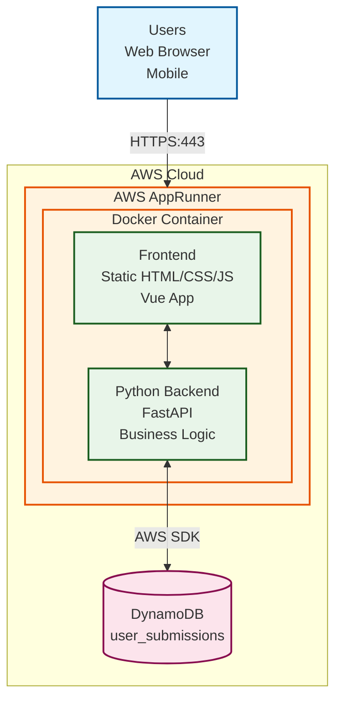

# Architecture

## System Overview

This is a simple architecture running a Docker container on AWS AppRunner that contains the application stack with DynamoDB for data persistence (when running in production mode). It's primary guiding principle is simplicity, and ease of development, there is a section that acknowledges the shortcomings and tradeoffs made to meet this objective 

## Architecture Diagram


```
```

## Component Details

### AWS AppRunner Service
- **Platform**: Fully managed container service
- **Auto-scaling**: Automatic scaling based on traffic
- **Network**: HTTPS endpoint with custom domain support

### Docker Container
Single container running the application stack:

- **Frontend**: Served as static files (HTML, CSS, JavaScript)
- **Backend**: Python web framework handling API requests

### Database Layer
- **DynamoDB**: NoSQL database service for production data persistence
  - **Tables**: user_submissions (see entity relationship diagram)
  - **Features**: Auto-scaling, point-in-time recovery
- **SQLite**: Available inside Docker container for all other data
  - **Location**: `/app/data/hotspot.db`
  - **Usage**: Risk scores and suburbs

## Data Flow

1. User sends HTTPS request to AppRunner service endpoint
2. AppRunner routes request to Docker container
3. Frontend serves static files for web interface
4. API calls route to Python backend
5. Backend reads/writes to DynamoDB using AWS SDK (some paths may still use SQLite)
6. Response sent back to user

## Limitations

- **Single region deployment**: No multi-region redundancy
- **Container limitations**: Single container instance (though AppRunner handles scaling)
- **DynamoDB costs**: Pay-per-request pricing model
- **Limited local development**: Uses SQLite for local development which is not persistent
