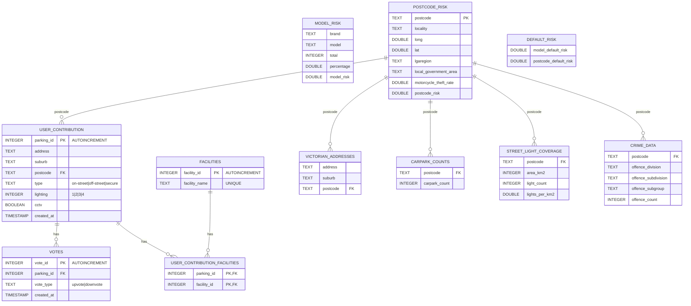

```mermaid
erDiagram
  MODEL_RISK {
    TEXT brand
    TEXT model
    INTEGER total
    DOUBLE percentage
    DOUBLE model_risk
  }

  POSTCODE_RISK {
    TEXT postcode PK
    TEXT locality
    DOUBLE long
    DOUBLE lat
    TEXT lgaregion
    TEXT local_government_area
    DOUBLE motorcycle_theft_rate
    DOUBLE postcode_risk
  }

  DEFAULT_RISK {
    DOUBLE model_default_risk
    DOUBLE postcode_default_risk
  }

  USER_CONTRIBUTION {
    INTEGER parking_id PK "AUTOINCREMENT"
    TEXT address
    TEXT suburb
    TEXT postcode FK
    TEXT type "on-street|off-street|secure"
    INTEGER lighting "1|2|3|4"
    BOOLEAN cctv
    TIMESTAMP created_at
  }

  FACILITIES {
    INTEGER facility_id PK "AUTOINCREMENT"
    TEXT facility_name "UNIQUE"
  }

  USER_CONTRIBUTION_FACILITIES {
    INTEGER parking_id PK, FK
    INTEGER facility_id PK, FK
  }

  VOTES {
    INTEGER vote_id PK "AUTOINCREMENT"
    INTEGER parking_id FK
    TEXT vote_type "upvote|downvote"
    TIMESTAMP created_at
  }

  VICTORIAN_ADDRESSES {
    TEXT address
    TEXT suburb
    TEXT postcode FK
  }

  CARPARK_COUNTS {
    TEXT postcode FK
    INTEGER carpark_count
  }

  STREET_LIGHT_COVERAGE {
    TEXT postcode FK
    INTEGER area_km2
    INTEGER light_count
    DOUBLE lights_per_km2
  }

  CRIME_DATA {
    TEXT postcode FK
    TEXT offence_division
    TEXT offence_subdivision
    TEXT offence_subgroup
    INTEGER offence_count
  }

  %% Relationships 
  USER_CONTRIBUTION ||--o{ VOTES : "has"
  USER_CONTRIBUTION ||--o{ USER_CONTRIBUTION_FACILITIES : "has"
  FACILITIES ||--o{ USER_CONTRIBUTION_FACILITIES : "has"

  %% Postcode-based relationships now actual FKs:
  POSTCODE_RISK ||--o{ USER_CONTRIBUTION : "postcode"
  POSTCODE_RISK ||--o{ VICTORIAN_ADDRESSES : "postcode"
  POSTCODE_RISK ||--o{ CARPARK_COUNTS : "postcode"
  POSTCODE_RISK ||--o{ STREET_LIGHT_COVERAGE : "postcode"
  POSTCODE_RISK ||--o{ CRIME_DATA : "postcode"
```
