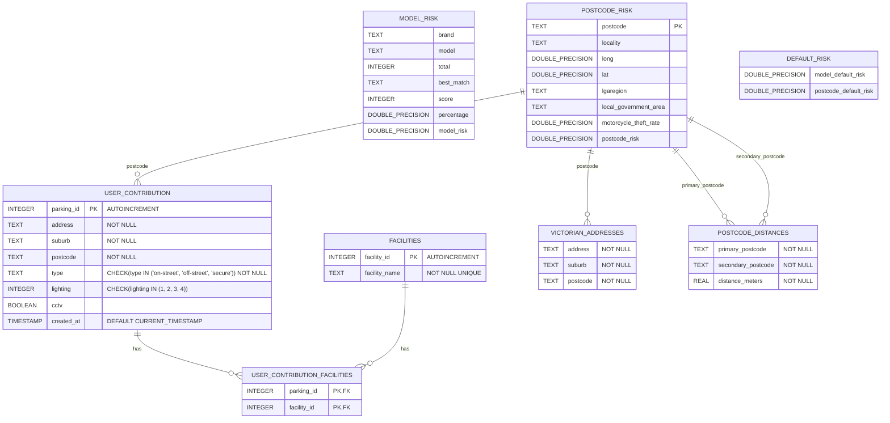

```mermaid
erDiagram
  MODEL_RISK {
    TEXT brand
    TEXT model
    INTEGER total
    TEXT best_match
    INTEGER score
    DOUBLE_PRECISION percentage
    DOUBLE_PRECISION model_risk
  }

  POSTCODE_RISK {
    TEXT postcode PK
    TEXT locality
    DOUBLE_PRECISION long
    DOUBLE_PRECISION lat
    TEXT lgaregion
    TEXT local_government_area
    DOUBLE_PRECISION motorcycle_theft_rate
    DOUBLE_PRECISION postcode_risk
  }

  DEFAULT_RISK {
    DOUBLE_PRECISION model_default_risk
    DOUBLE_PRECISION postcode_default_risk
  }

  USER_CONTRIBUTION {
    INTEGER parking_id PK "AUTOINCREMENT"
    TEXT address "NOT NULL"
    TEXT suburb "NOT NULL"
    TEXT postcode "NOT NULL"
    TEXT type "CHECK(type IN ('on-street', 'off-street', 'secure')) NOT NULL"
    INTEGER lighting "CHECK(lighting IN (1, 2, 3, 4))"
    BOOLEAN cctv
    TIMESTAMP created_at "DEFAULT CURRENT_TIMESTAMP"
  }

  FACILITIES {
    INTEGER facility_id PK "AUTOINCREMENT"
    TEXT facility_name "NOT NULL UNIQUE"
  }

  USER_CONTRIBUTION_FACILITIES {
    INTEGER parking_id PK, FK
    INTEGER facility_id PK, FK
  }

  VICTORIAN_ADDRESSES {
    TEXT address "NOT NULL"
    TEXT suburb "NOT NULL"
    TEXT postcode "NOT NULL"
  }

  POSTCODE_DISTANCES {
    TEXT primary_postcode "NOT NULL"
    TEXT secondary_postcode "NOT NULL"
    REAL distance_meters "NOT NULL"
  }

  %% Relationships
  USER_CONTRIBUTION ||--o{ USER_CONTRIBUTION_FACILITIES : "has"
  FACILITIES ||--o{ USER_CONTRIBUTION_FACILITIES : "has"

  %% Foreign key relationships through postcode matching
  POSTCODE_RISK ||--o{ USER_CONTRIBUTION : "postcode"
  POSTCODE_RISK ||--o{ VICTORIAN_ADDRESSES : "postcode"
  POSTCODE_RISK ||--o{ POSTCODE_DISTANCES : "primary_postcode"
  POSTCODE_RISK ||--o{ POSTCODE_DISTANCES : "secondary_postcode"
```
