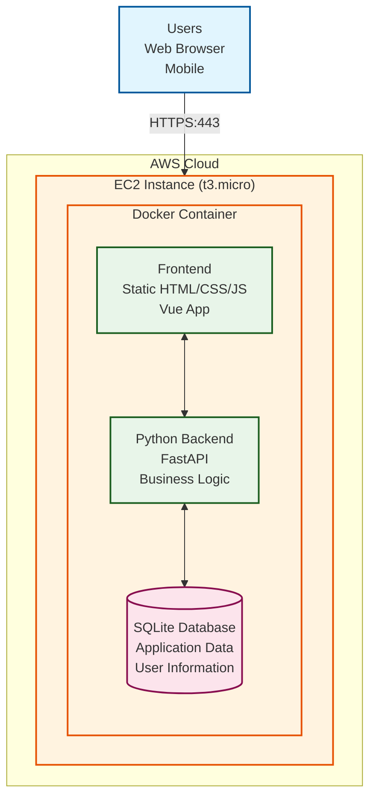

# Architecture

## System Overview

This is a simple architecture running a Docker container on an AWS t3.micro instance that contains the entire application stack. It's primary guiding principle is simplicity, and ease of development, there is a section that acknowledges the shortcomings and tradeoffs made to meet this objective. 

## Architecture Diagram


```
```

## Component Details

### EC2 Instance
- **Type**: t3.micro (1 vCPU, 1 GB RAM)
- **OS**: Amazon Linux 2
- **Network**: Public IP with security group allowing HTTPS (443)

### Docker Container
Single container running the entire application stack:

- **Frontend**: Served as static files (HTML, CSS, JavaScript)
- **Backend**: Python web framework handling API requests
- **Database**: SQLite file stored in a Docker volume for persistence

## Data Flow

1. User sends HTTPS request to EC2 public IP
2. Docker container receives request on port 443
3. Frontend serves static files for web interface
4. API calls route to Python backend
5. Backend reads/writes to SQLite database
6. Response sent back to user

## Limitations

- **Single point of failure**: No redundancy
- **Limited scalability**: Bound by t3.micro resources
- **SQLite constraints**: Not suitable for high concurrency
- **No load balancing**: Single instance only
- **Manual backups**: Need to implement backup strategy
